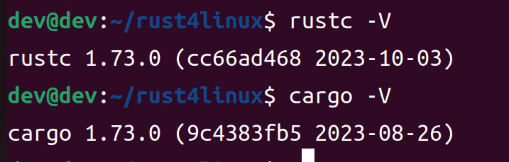
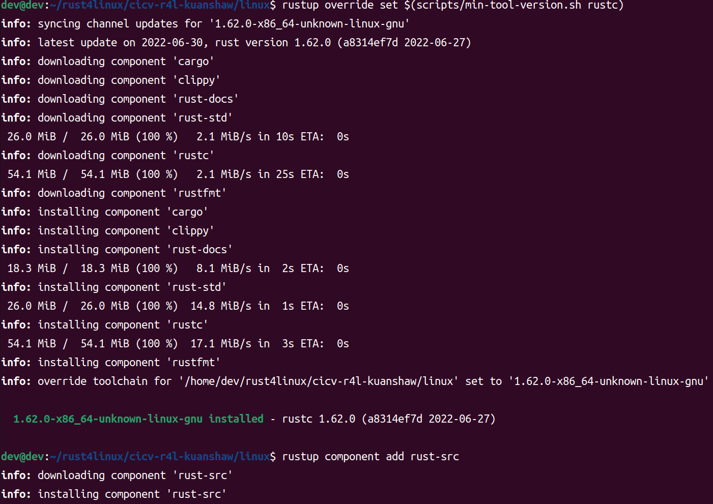
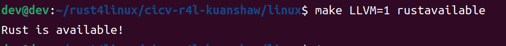
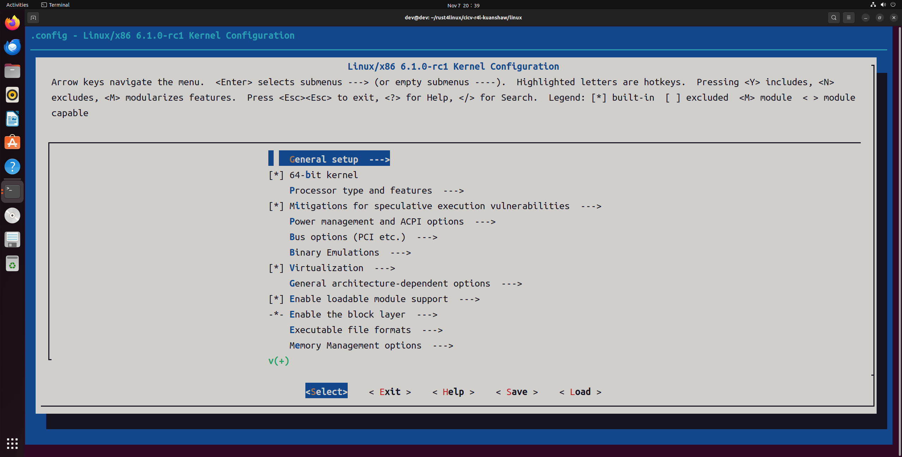
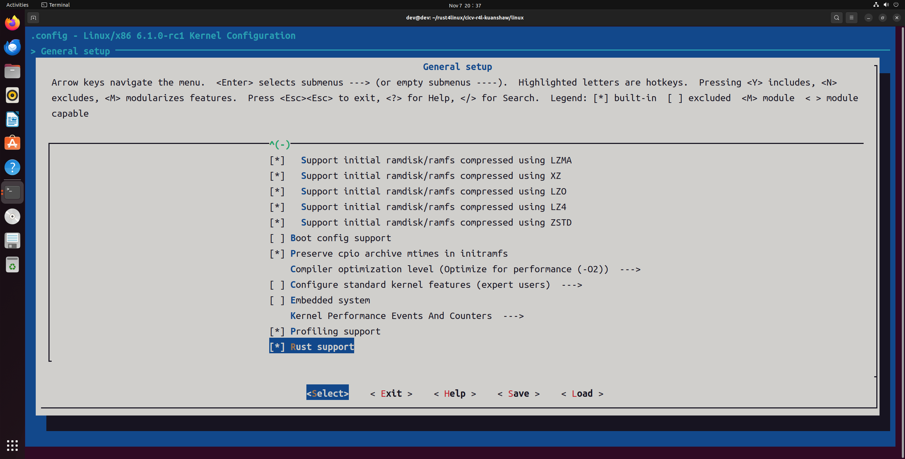
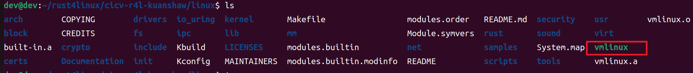

# 环境搭建与homework1

kuanshaw

20231107

# 环境搭建

## 安装 Ubuntu22.04 虚拟机

换源：

```
sudo cp /etc/apt/sources.list /etc/apt/sources.list.bak
sudo gedit /etc/apt/sources.list
```

sources.list

```
deb https://mirrors.tuna.tsinghua.edu.cn/ubuntu/ jammy main restricted universe multiverse
deb-src https://mirrors.tuna.tsinghua.edu.cn/ubuntu/ jammy main restricted universe multiverse
deb https://mirrors.tuna.tsinghua.edu.cn/ubuntu/ jammy-updates main restricted universe multiverse
deb-src https://mirrors.tuna.tsinghua.edu.cn/ubuntu/ jammy-updates main restricted universe multiverse
deb https://mirrors.tuna.tsinghua.edu.cn/ubuntu/ jammy-backports main restricted universe multiverse
deb-src https://mirrors.tuna.tsinghua.edu.cn/ubuntu/ jammy-backports main restricted universe multiverse
deb https://mirrors.tuna.tsinghua.edu.cn/ubuntu/ jammy-security main restricted universe multiverse
deb-src https://mirrors.tuna.tsinghua.edu.cn/ubuntu/ jammy-security main restricted universe multiverse
```


## 环境准备

### rust 安装

```
export RUSTUP_DIST_SERVER=https://mirrors.ustc.edu.cn/rust-static 
export RUSTUP_UPDATE_ROOT=https://mirrors.ustc.edu.cn/rust-static/rustup
curl --proto '=https' --tlsv1.2 -sSf https://sh.rustup.rs | sh
```




修改 cargo 镜像源

```
vim ~/.cargo/config
```

config

```
[source.crates-io]
replace-with = 'ustc'

[source.ustc]
registry = "git://mirrors.ustc.edu.cn/crates.io-index"
```


### 相关库

```
sudo apt install build-essential libtool texinfo gzip zip unzip patchutils cmake ninja-build automake bison flex gperf grep sed gawk bc zlib1g-dev libexpat1-dev libmpc-dev libncurses-dev libglib2.0-dev libfdt-dev libpixman-1-dev libelf-dev libssl-dev

sudo apt-get install clang-format clang-tidy clang-tools clang clangd libc++-dev libc++1 libc++abi-dev libc++abi1 libclang-dev libclang1 liblldb-dev libllvm-ocaml-dev libomp-dev libomp5 lld lldb llvm python3-clang

apt install clang
```


```
apt install qemu-system-x86

# 查看版本
qemu-system-x86_64 --version
```


## 拉取代码库

```
git clone git@github.com:cicvedu/cicv-r4l-kuanshaw.git
```


## 配置 linux 文件夹

```
cd cicv-r4l-kuanshaw/linux

rustup override set $(scripts/min-tool-version.sh rustc)
rustup component add rust-src
cargo install --locked --version $(scripts/min-tool-version.sh bindgen) bindgen
rustup component add rustfmt
rustup component add clippy
```






# homework1

```
make x86_64_defconfig
make LLVM=1 menuconfig

#set the following config to yes
General setup
        ---> [*] Rust support
```





Save and Exit.


make

```
make LLVM=1 -j8
```


success




