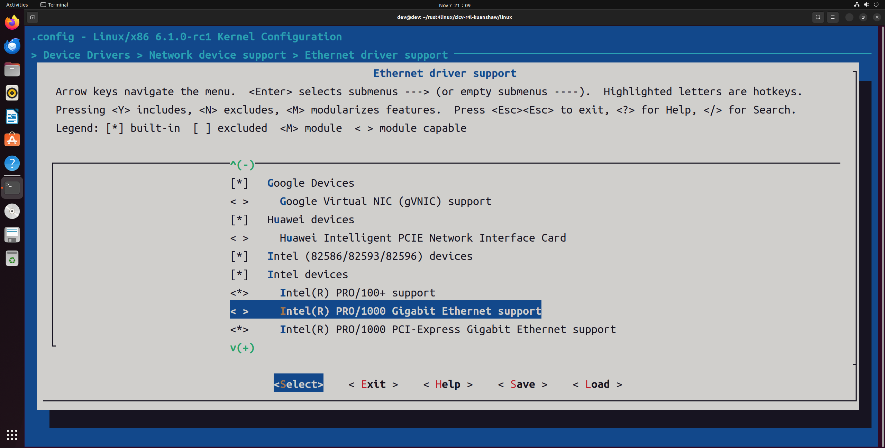
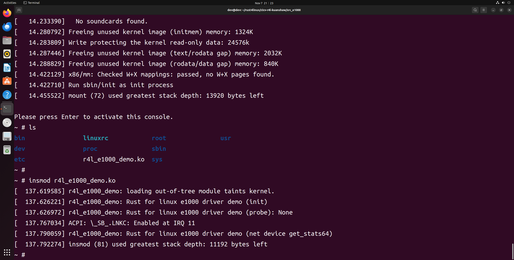
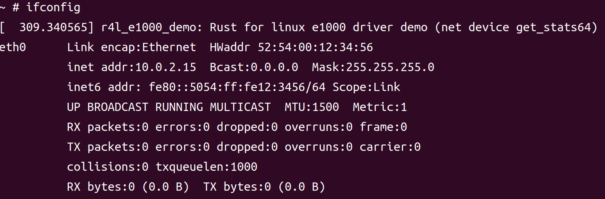
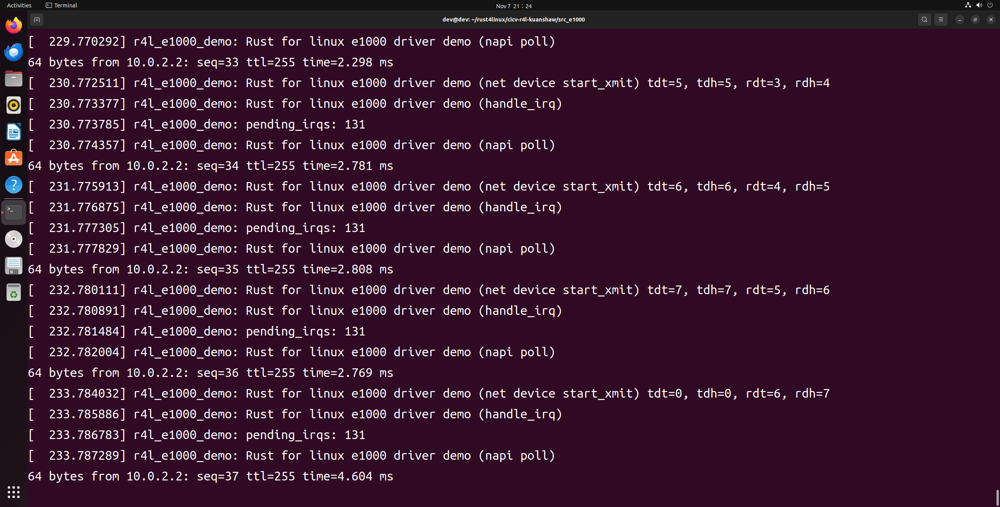
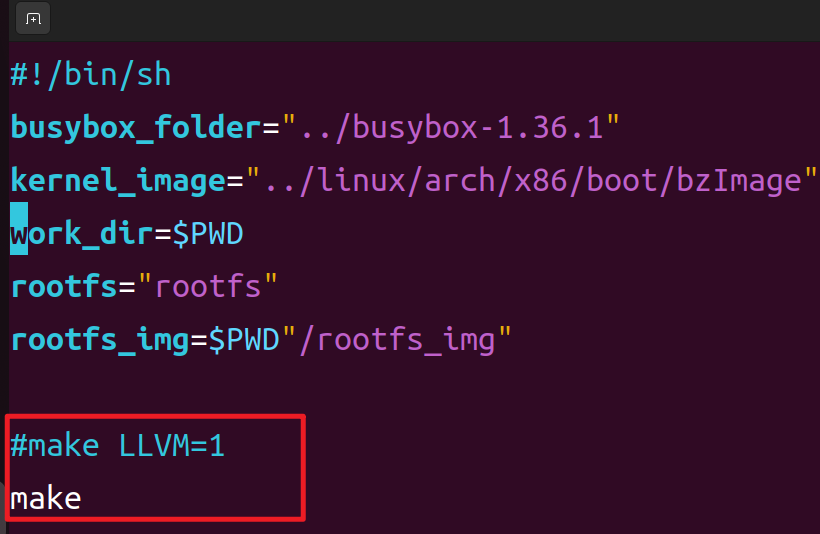
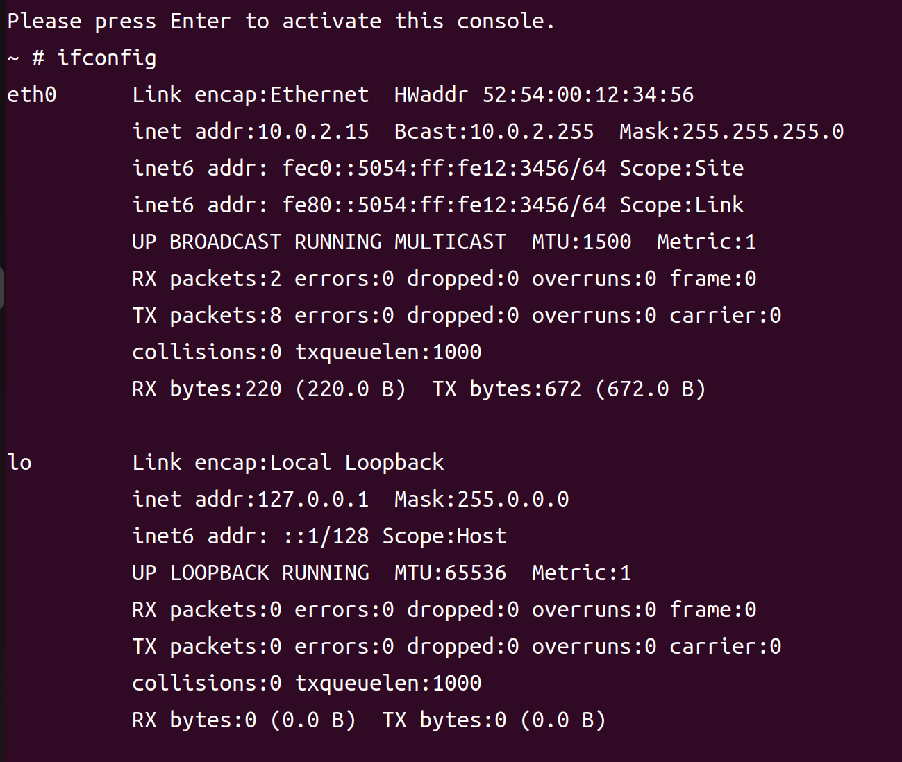
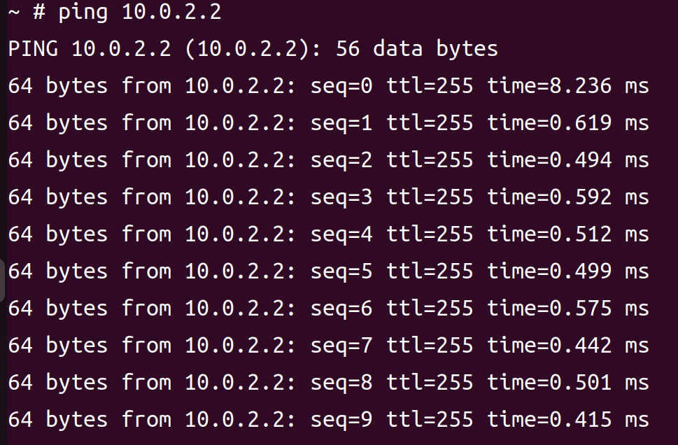

# homework2

kuanshaw

20231107

## rust 版本 e1000 驱动模块编译加载

感谢米老师！

### 禁用 linux 内核驱动自带的 e1000 驱动

```
cd linux
make LLVM=1 menuconfig
make LLVM=1 -j8
```

Device Drivers > Network device support > Ethernet driver support > Intel devices, Intel(R) PRO/1000 Gigabit Ethernet support



save and exit

### 编译 e1000 驱动模块

**运行前需要确保你已经编译 busybox，否则将无法生成 image**

```
cd src_e1000
chmod 777 ./build_image.sh

./build_image.sh
```

build_image.sh

```shell
#!/bin/sh
busybox_folder="../busybox-1.36.1"
kernel_image="../linux/arch/x86/boot/bzImage"
work_dir=$PWD
rootfs="rootfs"
rootfs_img=$PWD"/rootfs_img"

make LLVM=1
echo $base_path
if [ ! -d $rootfs ]; then
    mkdir $rootfs
fi
cp $busybox_folder/_install/*  $rootfs/ -rf
cp $work_dir/r4l_e1000_demo.ko $work_dir/$rootfs/
cd $rootfs
if [ ! -d proc ] && [ ! -d sys ] && [ ! -d dev ] && [ ! -d etc/init.d ]; then
    mkdir proc sys dev etc etc/init.d
fi

if [ -f etc/init.d/rcS ]; then
    rm etc/init.d/rcS
fi
echo "#!/bin/sh" > etc/init.d/rcS
echo "mount -t proc none /proc" >> etc/init.d/rcS
echo "mount -t sysfs none /sys" >> etc/init.d/rcS
echo "/sbin/mdev -s" >> etc/init.d/rcS
echo "mknod /dev/cicv c 248 0" >> etc/init.d/rcS
chmod +x etc/init.d/rcS
if [ -f $rootfs_img ]; then
    rm $rootfs_img
fi

cd $work_dir

cd $rootfs
find . | cpio -o --format=newc > $rootfs_img

cd $work_dir

qemu-system-x86_64 \
-netdev "user,id=eth0" \
-device "e1000,netdev=eth0" \
-object "filter-dump,id=eth0,netdev=eth0,file=dump.dat" \
-kernel $kernel_image \
-append "root=/dev/ram rdinit=sbin/init ip=10.0.2.15::10.0.2.1:255.255.255.0 console=ttyS0 no_timer_check" \
-nographic \
-initrd $rootfs_img
```





### 安装 e1000 驱动

安装前

```
ifconfig
```


```
insmod r4l_e1000_demo.ko
ifconfig
```

安装后




### 测试 e1000 驱动

```
ip link set eth0 up
ip addr add broadcast 10.0.2.255 dev eth0
ip addr add 10.0.2.15/255.255.255.0 dev eth0 
ip route add default via 10.0.2.1

ping 10.0.2.2
```





### 退出 qemu

Ctrl A + X


## C 版本 e1000 网卡对比

在 linux 文件夹中把 e1000 的驱动打开，然后编译

```
cd linux
make -j8
```

修改 build_image.sh




重新编译并运行 qemu，可以看到不需要加载就可以看到网卡设备

```
cd src_e1000
./build_image.sh

ifconfig
ping 10.0.2.2
```






## Q&A

在该文件夹中调用make LLVM=1，该文件夹内的代码将编译成一个内核模块。请结合你学到的知识，回答以下两个问题：

1、编译成内核模块，是在哪个文件中以哪条语句定义的？

- `/home/dev/rust4linux/cicv-r4l-kuanshaw/src_e1000/Kbuild` 中 `obj-m` 为编译为模块，`obj-y` 为编译进内核。

2、该模块位于独立的文件夹内，却能编译成Linux内核模块，这叫做out-of-tree module，请分析它是如何与内核代码产生联系的？

- 通过 `KDIR` 环境变量指定 linux 内核代码路径