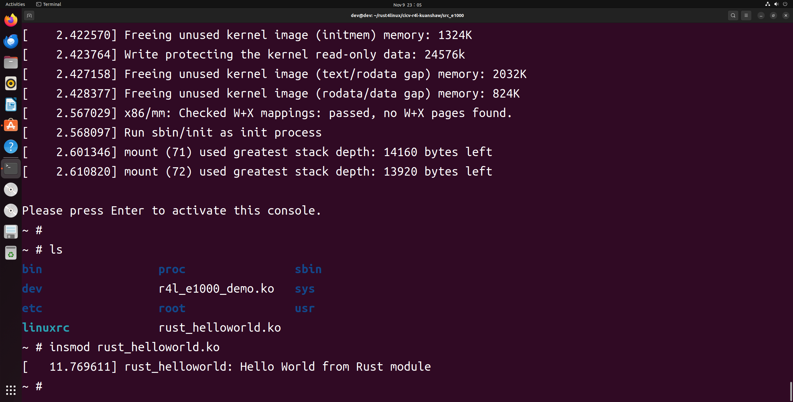

# homework3


## 新建模块rust代码

```
cd linux/sample/rust
vim rust_helloworld.rs
```

rust_helloworld.rs

```
// SPDX-License-Identifier: GPL-2.0
//! Rust minimal sample.
      
use kernel::prelude::*;
      
module! {
  type: RustHelloWorld,
  name: "rust_helloworld",
  author: "whocare",
  description: "hello world module in rust",
  license: "GPL",
}
      
struct RustHelloWorld {}
      
impl kernel::Module for RustHelloWorld {
  fn init(_name: &'static CStr, _module: &'static ThisModule) -> Result<Self> {
      pr_info!("Hello World from Rust module\r\n");
      Ok(RustHelloWorld {})
  }
}
```


## 修改 Makefile

```
obj-$(CONFIG_SAMPLE_RUST_HELLOWORLD)            += rust_helloworld.o
```


## 修改 Kconfig


```
config SAMPLE_RUST_HELLOWORLD
        tristate "Print Helloworld in Rust"
        help
          This option builds the hello world for Rust.

          If unsure, say N.
```


## 编译内核

```
# 回到 linux 目录下
cd ../../
make LLVM=1 distclean
make x86_64_defconfig
make LLVM=1 menuconfig
```

Kernel hacking

  ---> Sample Kernel code

​      ---> Rust samples

​              ---> <M>Print Helloworld in Rust (NEW)

下图位置中按 y 选中，并回车


下图位置中按 y 选中，并回车


按M选中，并保存退出。注意这里是按的 M。


 编译

```
make LLVM=1 -j8
```


## 仿真运行


```
cd ../src_e1000
cp ../linux/samples/rust/rust_helloworld.ko rootfs
./build_image.sh

insmod rust_helloworld.ko
```




